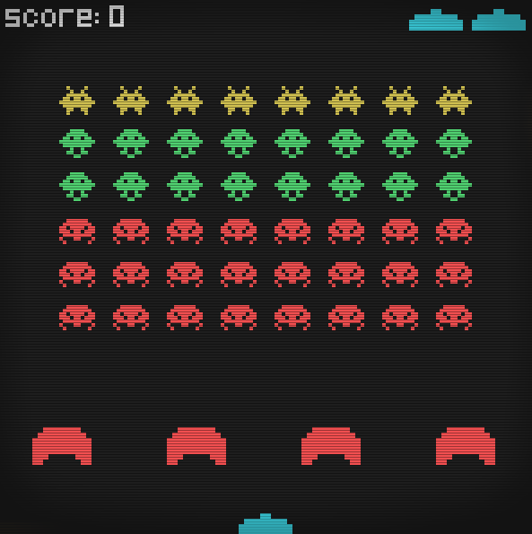

# SpaceInvaders

Coded in Python with Pygame.



### Controls

Left/right arrow keys to move.  
Space to shoot lasers.

### Running the game

From root:
```shell
$ cd src/
$ python main.py
```
### Atributions

Background music: [wyver9](https://opengameart.org/content/arcade-boss-tracks-8-bitchiptune)  
Game sounds: [SubspaceAudio](https://opengameart.org/content/512-sound-effects-8-bit-style)  
Graphics/Tutorial: [Clear Code](https://www.youtube.com/channel/UCznj32AM2r98hZfTxrRo9bQ)  